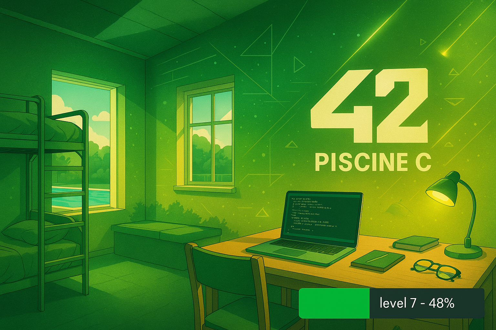
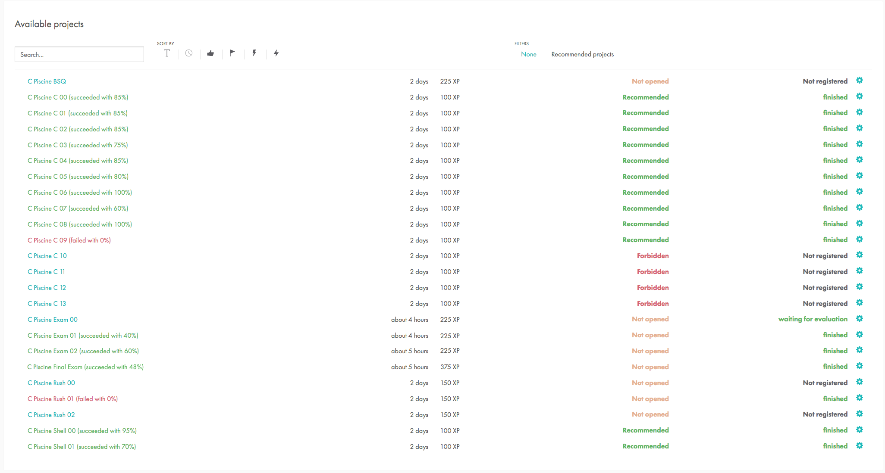

|    Status and Projects     |
|:--------------------------:|
|    |
|   |

 

---

🇫🇷 FRENCH VERSION

	Ceci est un ensemble de projets réalisés pendant la <strong>Piscine C</strong> de l'école 42 (juillet 2023).

## Préambule

Ce parcours intensif d’un mois couvre les bases du shell UNIX et du langage C, sans bibliothèque externe. L’ensemble des exercices va de simples commandes à l’écriture de bibliothèques, en passant par la manipulation de mémoire, de pointeurs et de fichiers.

## Modules complétés

### Shell

| Module                                    | Description                                                                                      |
|-------------------------------------------|--------------------------------------------------------------------------------------------------|
| [Shell00](./subject/PiscineC_Shell00.pdf) | Commandes UNIX, permissions, `tar`, `ssh`, `diff`, `find`, etc.                                  |
| [Shell01](./subject/PiscineC_Shell01.pdf) | Scripts shell, manipulations de groupes, fichiers spéciaux, arithmétique en bases personnalisées |

### Langage C

| Module                            | Concepts abordés                                                     |
|-----------------------------------|----------------------------------------------------------------------|
| [C00](./subject/PiscineC_C00.pdf) | fonctions simples (`ft_putchar`, `ft_putnbr`, `ft_print_comb`, etc.) |
| [C01](./subject/PiscineC_C01.pdf) | pointeurs, swap, division, affichage de chaînes                      |
| [C02](./subject/PiscineC_C02.pdf) | manipulation de chaînes de caractères                                |
| [C03](./subject/PiscineC_C03.pdf) | concaténation, comparaison, recherche dans les chaînes               |
| [C04](./subject/PiscineC_C04.pdf) | conversion ASCII, base numérique, `ft_atoi`, `ft_putnbr_base`        |
| [C05](./subject/PiscineC_C05.pdf) | récursivité, factorielle, puissances, nombres premiers               |
| [C06](./subject/PiscineC_C06.pdf) | manipulation des arguments de `main`                                 |
| [C07](./subject/PiscineC_C07.pdf) | allocation dynamique, `ft_split`, `ft_strjoin`, `ft_convert_base`    |
| [C08](./subject/PiscineC_C08.pdf) | headers personnalisés, macros, structures                            |
| [C09](./subject/PiscineC_C09.pdf) | création de bibliothèque `libft.a` et Makefile                       |

### Rush01

<a href="./subject/PiscineC_Rush01.pdf">Projet</a> d'équipe — résolution d’un puzzle logique (type Skyscraper 4x4) avec `malloc`, `write`, `free`.

---

🇬🇧 ENGLISH VERSION

	This is a set of projects completed during the <strong>42 C Piscine</strong> (July 2023).

## Preamble

This intensive one-month program covers UNIX shell basics and C language fundamentals without external libraries. It ranges from command-line basics to creating custom libraries, working with memory, pointers, files, and more.

## Completed Modules

### Shell

| Module                                    | Description                                                              |
|-------------------------------------------|--------------------------------------------------------------------------|
| [Shell00](./subject/PiscineC_Shell00.pdf) | UNIX basics: permissions, `tar`, `ssh`, `diff`, `find`, etc.             |
| [Shell01](./subject/PiscineC_Shell01.pdf) | Shell scripting, groups, special files, weird arithmetic in custom bases |

### C Language

| Module                            | Topics covered                                                     |
|-----------------------------------|--------------------------------------------------------------------|
| [C00](./subject/PiscineC_C00.pdf) | basic functions (`ft_putchar`, `ft_putnbr`, `ft_print_comb`, etc.) |
| [C01](./subject/PiscineC_C01.pdf) | pointers, swap, division, string output                            |
| [C02](./subject/PiscineC_C02.pdf) | string manipulation                                                |
| [C03](./subject/PiscineC_C03.pdf) | concatenation, comparison, string search                           |
| [C04](./subject/PiscineC_C04.pdf) | ASCII conversion, base conversion, `ft_atoi`, `ft_putnbr_base`     |
| [C05](./subject/PiscineC_C05.pdf) | recursion, factorial, powers, prime numbers                        |
| [C06](./subject/PiscineC_C06.pdf) | working with `main` arguments                                      |
| [C07](./subject/PiscineC_C07.pdf) | dynamic memory, `ft_split`, `ft_strjoin`, `ft_convert_base`        |
| [C08](./subject/PiscineC_C08.pdf) | custom headers, macros, structures                                 |
| [C09](./subject/PiscineC_C09.pdf) | creating a static library `libft.a` and Makefile                   |

### Rush01

Team <a href="./subject/PiscineC_Rush01.pdf">project</a> — solve a 4x4 logical puzzle (Skyscraper) using only `malloc`, `write`, and `free`.

---

🇷🇺 RUSSIAN VERSION

	Это проекты, выполненные в рамках <strong>C Piscine</strong> школы 42 (июль 2023 года).

## Преамбула

Интенсивный курс длительностью один месяц, охватывающий основы командной строки UNIX и языка C. Все задания выполнялись без сторонних библиотек, вручную управляя памятью, указателями и файлами.

## Выполненные модули

### Shell

| Модуль                                    | Описание                                                                                        |
|-------------------------------------------|-------------------------------------------------------------------------------------------------|
| [Shell00](./subject/PiscineC_Shell00.pdf) | Базовые команды UNIX: `chmod`, `tar`, `ssh`, `diff`, `find` и др.                              |
| [Shell01](./subject/PiscineC_Shell01.pdf) | Скрипты на shell, группы, нестандартные имена файлов, арифметика в странных системах счисления |

### Язык C

| Модуль                            | Темы                                                               |
|-----------------------------------|--------------------------------------------------------------------|
| [C00](./subject/PiscineC_C00.pdf) | простые функции (`ft_putchar`, `ft_putnbr`, `ft_print_comb` и др.) |
| [C01](./subject/PiscineC_C01.pdf) | указатели, обмен значениями, вывод строк                           |
| [C02](./subject/PiscineC_C02.pdf) | работа со строками                                                 |
| [C03](./subject/PiscineC_C03.pdf) | конкатенация, сравнение строк, поиск подстрок                      |
| [C04](./subject/PiscineC_C04.pdf) | ASCII, преобразование чисел и баз                                  |
| [C05](./subject/PiscineC_C05.pdf) | рекурсия, факториал, степени, простые числа                        |
| [C06](./subject/PiscineC_C06.pdf) | обработка аргументов командной строки                              |
| [C07](./subject/PiscineC_C07.pdf) | динамическое выделение памяти, `ft_split`, `ft_strjoin`            |
| [C08](./subject/PiscineC_C08.pdf) | собственные `.h` файлы, макросы, структуры                         |
| [C09](./subject/PiscineC_C09.pdf) | создание библиотеки `libft.a` и Makefile                           |

### Rush01

Командный <a href="./subject/PiscineC_Rush01.pdf">проект</a> — решение логической задачи (Skyscraper 4x4) с помощью `malloc`, `write`, `free`.

---

